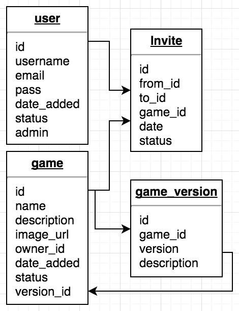
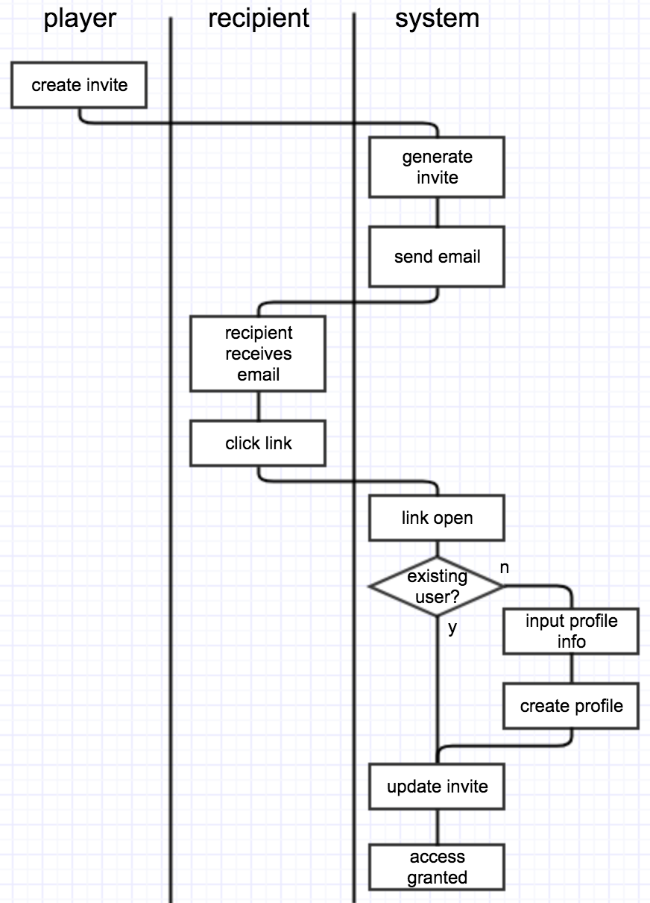
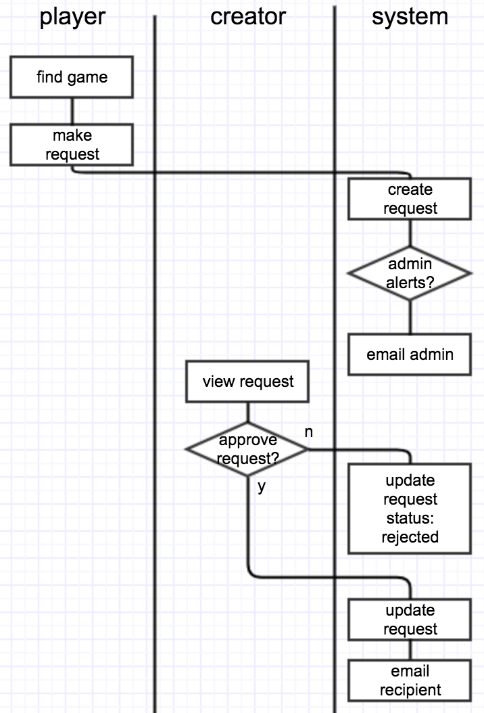

Purpose:
---
Ceate a _**simple**_ web app that will allow game creators to manage beta releases to approved players.

Srsy, tho - SIMPLE is key here.

Features:
===
- Games can be created and edited as well as their versions.
- Game Creators can invite Players.
- Players can browse games and request access to games.
- Creators can approve requests from Players
- Creators can
- Admins must approve games before they are viewable.
- Admins can promote Players to Creator

Diagrams:
===

ERD:
---

Invite flow:
---

Request flow:
---

Tech:
===
- PHP
- MySQL
- HTML
- CSS
- JavaScript
- AngularJS
- Bootstrap CSS

History:
===
I really dig the game Anti|Piracy, but Charles won't give me a build. At GlitchCon17 I kept pestering him for one and he said "if I had a way to distribute a beta like what you've got for Newt One...". So, of course, *lightbulb* and I'm making this now. Hopefully it'll be helpful for other indie game devs.

Future:
===
- api functionality
- stats! numbers! stuff like that!
